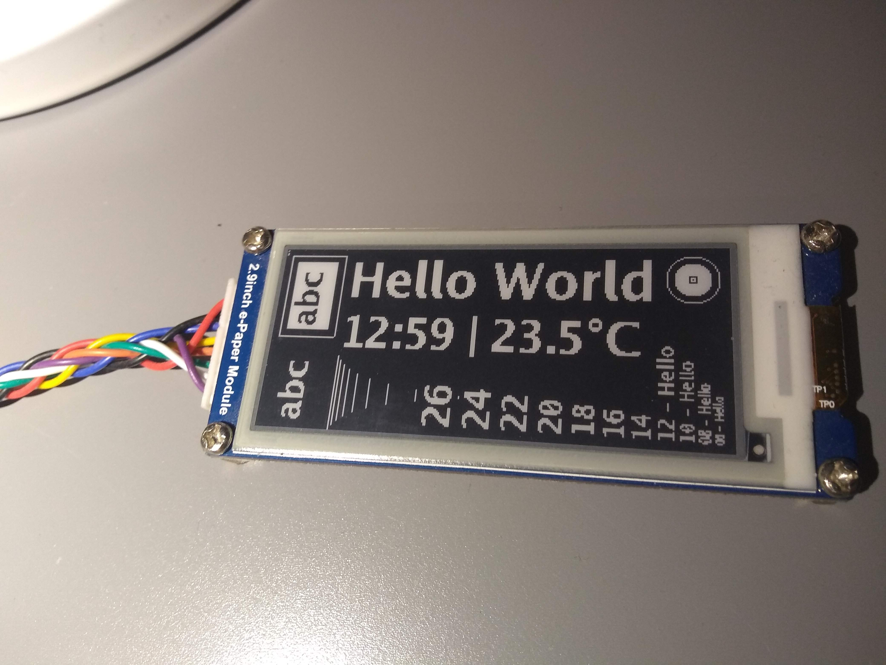
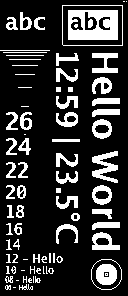

# epaper
Driver for Waveshare Electronics e-paper display - in Go

**Work in progress** - Only 2.9" Waveshare Electronics BW display supported now.

### What it can do (so far)

package `epaper` (comunicates with display over SPI):

  - Initialize e-paper display to use either `full` or `partial` update
  - Swap frame buffer of e-paper display
  - Clear frame buffer using black / or white color
  - Copy arbitraty monochromatic bitmap image to frame buffer
  - Put display to Sleep
  
package `epaper/image` (creates in-memmory monochromatic bitmap `image.Mono`):
  - Clear whole image to black or white color
  - Draw black or white horizontal / vertical **lines**
  - Draw black or white stroked / filled **rectangle**
  - Draw black or white stroked / filled **circle**
  - Write black or white **text** using Go font (chars from [WGL4](https://en.wikipedia.org/wiki/Windows_Glyph_List_4) charset)
  - **Paste another image** (while converting it to monochromatic color mode) using go's `image.Image` interface.
  - **Rotate** bitmap 90° in each direction
  - **Flip** (mirror) bitmap vertically or horizontally
  - **Invert** colors
  

